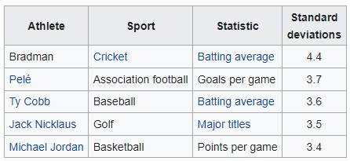

# Bradman's 99.94 v/s Leicester 2016 - The Greater Achievement

1. Leicester City's Premier League win of 2015/16 came with odds of <b>5000/1</b> before the start of the season.

2. The Australian cricketer Sir Donald Bradman had a career batting average of 99.94 - a statistic that, <a href="https://en.wikipedia.org/wiki/Don_Bradman">according to Charles Davis</a>, made him the greatest sportsman ever (across all sports): 

A simple visualization of career batting averages shows how far ahead Bradman is, compared to other greats of the sport, across generations:

Obviously, the two events above cannot be simply compared as they are in different sports, different eras, one is a team sport while the other is an individual accomplishment, and so on. Instead, this analysis checks which of the two events was statistically more improbable, and therefore the greater achievement.

In other words, this analysis simply compares whether the probability of Bradman's average is a rarer than 1 in 5000 chance.

Therefore, the <b>null hypothesis</b> can be framed as:
 

H0: Avg = 99.94 with level of significance α = 0.0002 (or 1 in 5000)

The dataset used to analyse batting data of cricketers is available as a public download <a href:"https://www.kaggle.com/veeralakrishna/icc-test-cricket-runs/version/2?select=ICC+Test+Batting+Figures.csv">here</a>.
 

The mean value of all batting averages in this dataset is <b>20.83</b>. However, this also includes data of non-batters. Bradman's average should be compared with other "pure" batsman. The mean batting average of these pure batsman in the dataset was <b>33.79</b>. Therefore:

<b>Mean Batting Average, μ</b> = 33.79

<b>Standard Deviation, σ</b> = 11.95

<b>Observed Value, x</b> = 99.94

Hence, Bradman's <b> Z-score</b> => (x - μ) / σ => (99.94 - 33.79) / 11.95 => <b>5.53</b>

A z-table lookup on a level of significance α = 0.0002, gives us a z-critical of 3.54. Since Bradman's z-score of 5.53 is greater than the z-critical value of 3.54, we can reject the null hypothesis, and the data suggests that Bradman's outlying batting average is a statistical occurrence rarer than 1 in 5000.

As a side note, plugging in a z-score of 5.53 gives us a Z-critical value of 0.999999927972299. In other words, Bradman's outlying average has an occurrence probability of <b>1 in over 50 million</b>! Re-doing the numbers to only include a certain minimum number of matches played, or by applying more stringent criteria to defining a 'pure batsman' results in even greater odds.

